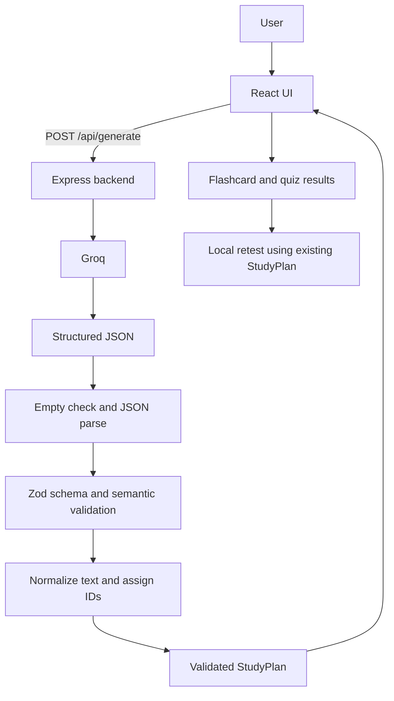

# RecallAI

RecallAI turns free-form notes or a topic into a study set you can actively review. It addresses the gap between reading material and testing what you can recall: each generated set contains an overview, flashcards, and a quiz, followed by focused retests.

## Features

- Generate a structured study plan from a topic or up to 8,000 characters of notes.
- Reveal flashcard answers, mark cards known or missed, and retest missed cards.
- Answer four-option quiz questions, see explanations and a score, and retest wrong answers.
- Keep the previous valid plan usable if regeneration fails; a successful new plan resets study progress.
- Show loading, slow-request, empty, and controlled error states on desktop and mobile layouts.

## Architecture

The stack is React 19, TypeScript, Vite, Express 5, Groq SDK, and Zod. `App` coordinates generation and the current section. `useStudyGeneration` owns requests, loading, errors, and stale-response protection. Feature components render interactions; `studySession.ts` owns the session reducer and derived scores. Generated `StudyPlan` data is treated as immutable, separate from ratings, answers, and navigation state. Retests make no Groq request.

## AI and data contract

Only the backend reads `GROQ_API_KEY` and calls Groq (`openai/gpt-oss-20b`, JSON Object Mode). The model is asked for a `title`, `summary`, 3–8 distinct `concepts`, 3–8 `flashcards` (`question`, `answer`), and 3–6 `quiz` questions (`question`, four distinct `options`, `correctOptionIndex` from 0 to 3, `explanation`). All text must be nonempty and within the bounds in `shared/studyPlan.ts`. The model does not supply IDs; the backend assigns `fc-1`, `q-1`, and so on for stable references within a plan.

The server checks for an empty response, parses JSON, validates the strict Zod shape, checks repeated questions and whether each explanation names its indexed answer, then assigns IDs. Any failed check becomes a controlled error rather than React data. The browser validates the returned plan again before storing it. JSON Object Mode alone does not guarantee a usable plan. Neither validation layer can prove factual correctness, so users should check AI-generated study content against their source material.

`POST /api/generate` accepts `{ "material": "..." }` and returns `{ "studyPlan": { ... } }` on success. Errors have `{ "error": { "code": "...", "message": "..." } }`: invalid/empty input is 400, oversized body is 413 (material over 8,000 characters is 400), invalid or empty AI output and provider failure are 502, rate limit is 429, timeout is 504, and server configuration/internal failures are 500. The generation deadline is 25 seconds; the request is aborted on timeout. The UI retains the previous plan after a failed regeneration and ignores responses from superseded requests. Raw model text, provider response bodies, and the API key are not returned to the browser.

## Run locally

Requires Node.js 20.19+.

1. Run `npm install`.
2. Copy `.env.example` to `.env` and set the server-only `GROQ_API_KEY`. Do not use a `VITE_` prefix.
3. Run `npm run dev` and open the Vite URL shown (normally `http://localhost:5173`). Express runs on port 3001; Vite proxies `/api` to it.

`GET /api/health` returns `{ "status": "ok" }` independently of Groq configuration. `npm test` runs deterministic tests without Groq. `npm run build` type-checks and builds the browser bundle. After building, `npm run start` serves the built app and API on port 3001 with a full dependency install.

## Verification and limitations

Automated tests cover content validation, ID assignment, provider failure mapping, API response handling, flashcard and quiz rules, scoring, retests, and session reset. A live Groq response and local frontend/API health checks were verified during development. Desktop interaction and mobile visual checks still require manual browser verification. The app does not persist plans across reloads, and AI answers can be inaccurate. There is no authentication or per-user rate limit; this is a local assignment prototype, not a public deployment configuration.

Manual submission check: generate a set; use overview, flashcards, quiz, and both retests; navigate away and back to confirm progress; generate a second topic and confirm progress resets. Force a failed regeneration and confirm the old set remains usable. At 320, 375, 390, and 430 px, check scrolling, wrapping, controls, quiz options, and visible keyboard focus.

## AI assistance and time

An AI coding assistant helped brainstorm the architecture, draft implementation and tests, debug behavior, and audit the final code. The implementation was iterated through code inspection, automated tests, builds, and local API checks; human browser and mobile review is still pending. The elapsed workspace development and audit time is approximately one hour; exact active time was not tracked.
